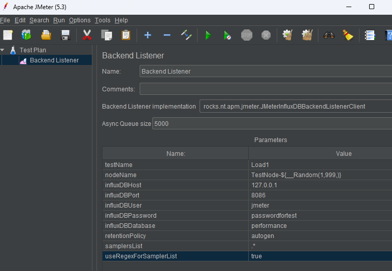

# Why do you need it?

Often, load testing requires a large load on the system, which 1 instance of JMeter cannot provide. At the moment, there is not a single working solution on the market to perform such tasks. So, in view of its high relevance, a solution was developed with the ability to run multiple instances of Jmeter in parallel from multiple machines. 
In addition to its main function, this solution allows you to track the result in real time when running a test.

> Disclaimer: In this example I purposely do not use docker containers and set up the environment on a clean VM, because in my opinion, only this installation option gives a complete picture of the interaction of services, which in turn is useful for newcomers.

Apache Jmeter can send data to external sources, which is useful for live benchmarking. In this example I will show how to set up this interaction and share a complete solution for configuring dashboards that I have been using for years on a variety of projects.

# Installing InfluxDB
First we need InfluxDB, I use a fairly old version 1.8, it has no GUI which we won't need because we will use Grafana to build the dashboard.

```bash
# Add the repository to the system:
sudo apt-key adv --keyserver keyserver.ubuntu.com --recv-keys 684A14CF2582E0C5
echo 'deb https://repos.influxdata.com/debian stable main' | sudo tee /etc/apt/sources.list.d/influxdata.list
# Install and run InfluxDB
sudo apt update && sudo apt install influxdb
sudo systemctl unmask influxdb.service
sudo systemctl start influxdb
# Check if the installation is correct:
influx -version
```
If the terminal shows "InfluxDB shell version: 1.8.10", then we have done everything correctly!

Next, for JMeter to be able to connect to our database, we have to create a connection data
```bash
# Open the database console:
influx
# Create database, in which JMeter will write data:
# Create database "performance"
# Create a user for the connection and give him access rights:
CREATE USER jmeter WITH PASSWORD 'passwordfortest'
GRANT ALL ON performance TO jmeter 
```
This completes the database setup. 

# Configuring JMeter

There are 2 good listener to work with the data from JMeter:
1. rocks.nt.apm.jmeter.JMeterInfluxDBBackendListenerClient 
2. org.apache.jmeter.visualizers.backend.influxdb.HttpMetricsSender

I will show the configuration for both of them, because they complement each other to some extent, but it is worth noting that for multithreaded load only the first one is fully suitable, because only it has information about the number of active traces, which you can summarize, in case you are running tests from several machines at the same time, as in my case.

Download the file https://github.com/NovatecConsulting/JMeter-InfluxDB-Writer/releases/download/v-1.2/JMeter-InfluxDB-Writer-plugin-1.2.jar and put it in the folder with JMeter >/lib/ext
Then add Backend Listener to our project and configure it





Where 127.0.0.1 is the server address where our InfluxDB resides

# Installing and configuring Grafana

In order to display the Influx data nicely we will need Grafana.
```bash
# Install dependencies
sudo apt install -y adduser libfontconfig1
# Download Grafana download not available from Russia, but we know what to do :)
wget https://dl.grafana.com/enterprise/release/grafana-enterprise_9.3.4_amd64.deb
# Install and startup
sudo dpkg -i grafana-enterprise_9.3.4_amd64.deb
sudo systemctl start grafana-server
```
After a successful start you can open http://127.0.0.1:3000 , where 127.0.0.1 is the address of the host where Grafana is installed. The first login is with login and password admin, after login the system will ask for a new admin password.
Connect InfluxDB as a data source on the page: http://127.0.0.1:3000/datasources


I'll give as an example 2 of my dashboards under each of the listener, in grafana we import the dashboard from JSON:

 1. https://github.com/kschepkin/perf-jmeter/blob/main/dashboards/Jmeter-Rocks-Dashboard.json
 2. https://github.com/kschepkin/perf-jmeter/blob/main/dashboards/Jmeter-Apache-Dashboard.json

# Dashboard description

As a result of the steps above we have two dashboards:
Rocks is designed to run several JMeter instances on different machines in parallel.
Rocks dashboard(./images/Rocks-parallel-dashboard.png)
Apache does not assume more than one load instance, but is handy as an additional data analysis tool because it is the only listener that reports detailed error information.


## Bonus: Setting up a test run in Jenkins
For test runs I am using multiple test machines at the same time, but with this approach raises the question of how to configure the environment quickly, especially with the frequent changes of these machines.
I solved the problem by writing a Pipeline script for Jenkins, the default script has 4 nodes, but can easily be upgraded to more, and to disable nodes specify OFF as a server address.
To work you need a few test machines on which you first need to install Java
```bash
# Install Java
sudo apt install default-jre default-jdk
```
Link to the Pipeline script for Jenkins:
https://github.com/kschepkin/perf-jmeter/blob/inProgress/jenkins-pipelines/parallel_pipeline.groovy
When setting up the jdk in Jenkins, you need to enable the "This is a parameterized build" option and add a String parameter named "PERF_TEST".
I've also attached a Pipeline and a Kill script that forcibly terminates all JMeter instances - will be needed if you need to terminate the tests early.
