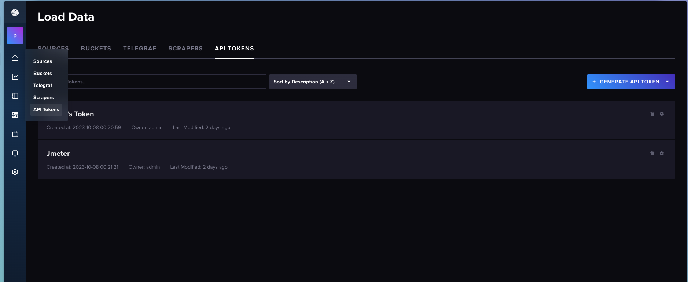
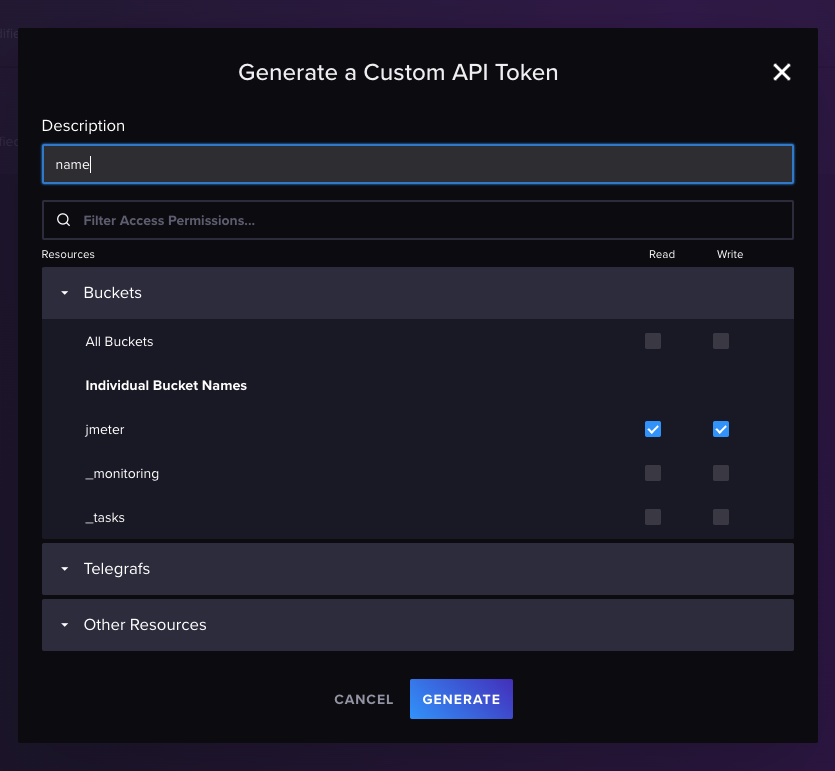
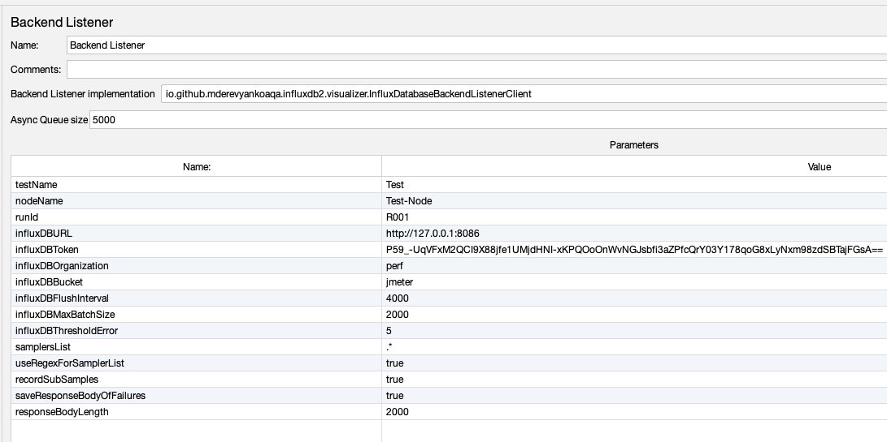
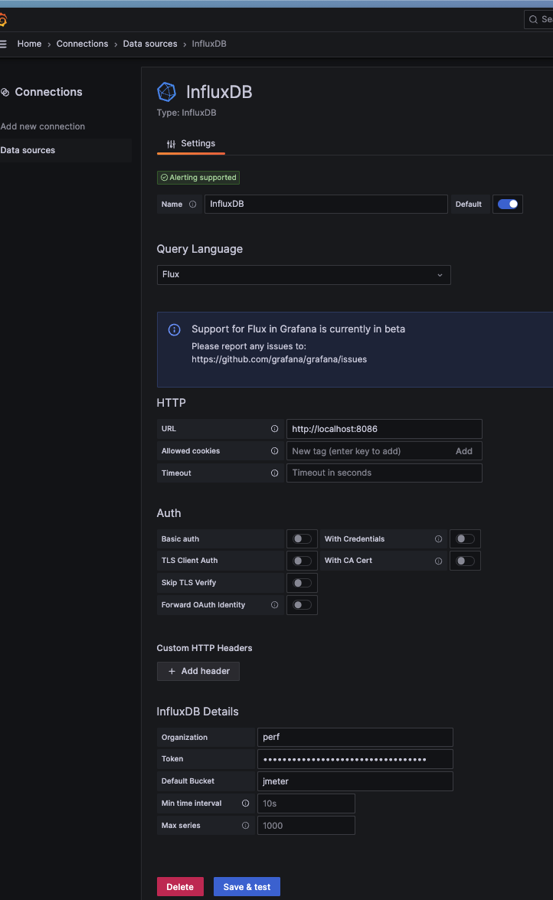

# О чем пойдет речь?
Часто нагрузочное тестирование требует большой нагрузки на систему, которую не может обеспечить 1 экземпляр JMeter. На данный момент я не нашел ни одного работающего решения для выполнения подобой задачи. Поэтому было разработано решение с возможностью параллельного запуска нескольких экземпляров Jmeter с нескольких машин. 
Помимо своей основной функции, данное решение позволяет отслеживать результат в режиме реального времени при запуске теста.


> Дисклеймер: в данном примере я умышленно не использую docker контейнеры и выполняю настройку окружения на чистой ВМ, т.к, по моему мнению, только такой вариант установки дает полную картину взаимодействия сервисов, что в свою очередь полезно для новичков.

Apache Jmeter умеет отправлять данные во внешние источники, что полезно для отслеживание выполнения тестов в реальном времени. В данном примере я расскажу как настроить подобное взаимодействие и поделюсь готовым решением, по настройке дашбордов, которые использую на множестве проектов ни один год.

# Установка InfluxDB
Для начала нам понадобится InfluxDB, который содержит свой графический интерфейс, но для построения дашбордов мы будем использовать Grafana.

```bash
# Скачиваем установщик:
wget https://dl.influxdata.com/influxdb/releases/influxdb2-2.7.1-amd64.deb
# Устанавливаем и запускаем InfluxDB
sudo dpkg -i influxdb2-2.7.1-amd64.deb
sudo service influxdb start
# Проверяем правильность установки:
sudo service influxdb status
```
Если в терминале появилось  "Active: active (running)", значит мы все сделали правильно!

Далее, для того чтоб JMeter мог подключиться к нашей базе, необходимо создать данные для подключения:
1) Переходим в консоль управления influx в бразузере по адресу http://127.0.0.1:8086  
    где 127.0.0.1 - адрес сервера, на котором располагается наша InfluxDB
2) Логин и пароль по умолчанию admin
3) При первом входе система предложит поменять пароль и создать организацию/бакет - делаем это, названия можно придумать самостоятельно
4) Переходим в Api Tokens 
5) Создаем новый токен с доступом к ранее созданному бакету на чтение и запись


На этом настройка БД завершена. 

# Настройка JMeter

Нам потребуется плагин jmeter-influxdb2-listener-plugin для работы с данными из JMeter,
cкачиваем файл [по ссылке](https://github.com/mderevyankoaqa/jmeter-influxdb2-listener-plugin/releases/download/v2.7/jmeter-plugins-influxdb2-listener-2.7.jar) и кладем его в папку с JMeter >/lib/ext
Далее добавляем Backend Listener в наш проект 


и настраиваем его



где 127.0.0.1 - адрес сервера, на котором располагается наша InfluxDB

# Установка и настройка Grafana

Для красивого отображения записанных в Influx данных нам потребуется Grafana.
```bash
# Устанавливаем зависимости
sudo apt install -y adduser libfontconfig1 musl
# Скачиваем Grafana загрузка недоступна из России, но мы то знаем что делать :)
wget https://dl.grafana.com/enterprise/release/grafana-enterprise_10.1.4_amd64.deb
# Установка и запуск
sudo dpkg -i grafana-enterprise_10.1.4_amd64.deb
sudo systemctl start grafana-server
```
После успешного старта можно открывать в браузере http://127.0.0.1:3000 , где 127.0.0.1 - адрес хоста, на котором установлена Grafana. Первый вход осуществляется с логином и паролем admin, после входа система попросит ввести новый пароль админа.
Подключаем InfluxDB в качестве источника данных на странице: http://127.0.0.1:3000/datasources



В графана импортируем дашборд из JSON, который можно скачать на (странице по ссылке](https://grafana.com/grafana/dashboards/13644-jmeter-load-test-org-md-jmeter-influxdb2-visualizer-influxdb-v2-0-flux/).


## Бонус: Настройка тестового прогона в Jenkins
Для прогона тестов я использую одновременно несколько тестовых машин, однако при таком подходе встает вопрос как быстро настроить окружение, особенно с учетом частой смены этих машин.
Я решил вопрос написанием Pipeline скрипта для Jenkins, скрипт по умолчанию расчитан на 4 ноды, однако легко модернизируется под большее количество, а для отключения ноды укажите OFF в качестве адреса сервера.
Для работы вам потребуется несколько тестовых машин, на которых предварительно требуется установить Java
```bash
# Устанавливаем Java
sudo apt install default-jre default-jdk
```
Ссылка на Pipeline скрипт для Jenkins:
[parallel_pipeline.groovy](https://github.com/kschepkin/perf-jmeter/blob/inProgress/jenkins-pipelines/parallel_pipeline.groovy)
При настройке джобы в Jenkins требуется включить опцию "Это - параметризированная сборка" и добавить String параметр с именем "PERF_TEST".