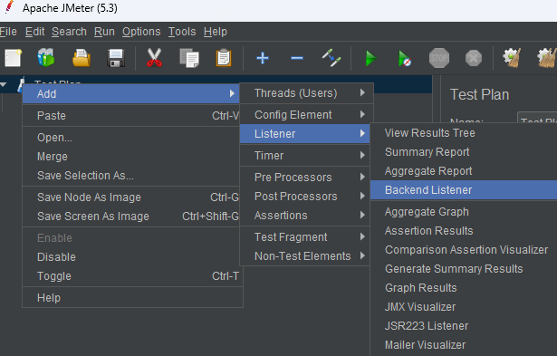

> Дисклеймер: в данном примере я умышленно не использую docker контейнеры и выполняю настройку окружения на чистой ВМ, т.к, по моему мнению, только такой вариант установки дает полную картину взаимодействия сервисов, что в свою очередь полезно для новичков.

Apache Jmeter умеет отправлять данные во внешние источники, что полезно для отслеживание выполнения тестов "в прямом эфире". В данном примере я расскажу как настроить подобное взаимодействие и поделюсь готовым решением, по настройке дашбордов, которые использую на множестве проектов ни один год.

Для начала нам понадобится InfluxDB, я использую довольно старую версию 1.8, в ней нет графического интерфейса, который, впрочем, нам не понадобится, потому как для построение дашбордов мы будем использовать Grafana.

```bash
# Добавляем репозиторий в систему:
sudo apt-key adv --keyserver keyserver.ubuntu.com --recv-keys 684A14CF2582E0C5
echo 'deb  https://repos.influxdata.com/debian stable main' | sudo tee /etc/apt/sources.list.d/influxdata.list
```
```bash
# Устанавливаем и запускаем InfluxDB
sudo apt update && sudo apt install influxdb
sudo systemctl unmask influxdb.service
sudo systemctl start influxdb
```
```bash
# Проверяем правильность установки:
influx -version
```
Если в терминале появилось  "InfluxDB shell version: 1.8.10", значит мы все сделали правильно!

Далее, для того чтоб JMeter мог подключиться к нашей базе, необходимо создать данные для подключения
```bash
# Открываем консоль работы с БД:
influx
# Создаем базу в которую JMeter будет писать данные:
create database "performance"
# Создаем пользователя для подключения и выдаем ему права на доступ к базе:
CREATE USER jmeter WITH PASSWORD 'passwordfortest'
GRANT ALL ON performance TO jmeter 
```
На этом настройка БД завершена. 

**Настройка JMeter**
Есть 2 хороших листенера для работы с данными из JMeter:
1. rocks.nt.apm.jmeter.JMeterInfluxDBBackendListenerClient 
2. org.apache.jmeter.visualizers.backend.influxdb.HttpMetricsSender

Я покажу настройку для обоих, потому что они в какой-то мере дополняют друг друга, однако стоит отметить, что для многопотоковой нагрузки полноценно подходит лишь первый, потому что только в нем имеется информация о количестве активных тредов, которые можно просуммировать, в случае если вы запускаете тесты одновременно с нескольких машин, как в моем случае.

Скачиваем файл https://github.com/NovatecConsulting/JMeter-InfluxDB-Writer/releases/download/v-1.2/JMeter-InfluxDB-Writer-plugin-1.2.jar и кладем его в папку с JMeter >/lib/ext
Далее добавляем Backend Listener в наш проект и настраиваем его



где 127.0.0.1 - адрес сервера, на котором располагается наша InfluxDB

Установка и настройка Grafana
```bash
# Устанавливаем зависимости
sudo apt install -y adduser libfontconfig1
# Скачиваем и устанавливаем Grafana (загрузка недоступна из России)
wget https://dl.grafana.com/enterprise/release/grafana-enterprise_9.3.4_amd64.deb
# Установка и запуск
sudo dpkg -i grafana-enterprise_9.3.4_amd64.deb
sudo systemctl start grafana-server
```
После успешного старта можно открывать в браузере http://127.0.0.1:3000 , где 127.0.0.1 - адрес хоста, на котором установлена Grafana. Первый вход осуществляется с логином и паролем admin, после входа система попросит ввести новый пароль админа.
Подключаем InfluxDB в качестве источника данных на странице: http://127.0.0.1:3000/datasources


Я приведу в качестве примера 2 своих дашборда под каждый из листенеров, в графана импортируем дашборд из JSON:
https://github.com/kschepkin/perf-jmeter/blob/main/dashboards/Jmeter-Rocks-Dashboard.json
https://github.com/kschepkin/perf-jmeter/blob/main/dashboards/Jmeter-Apache-Dashboard.json

